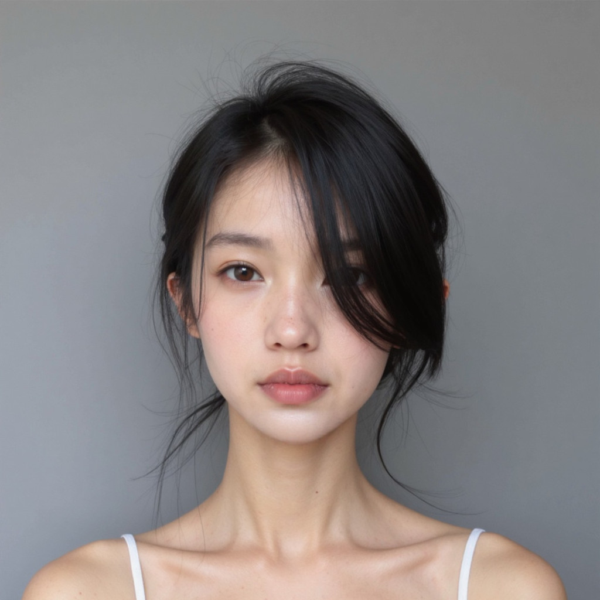
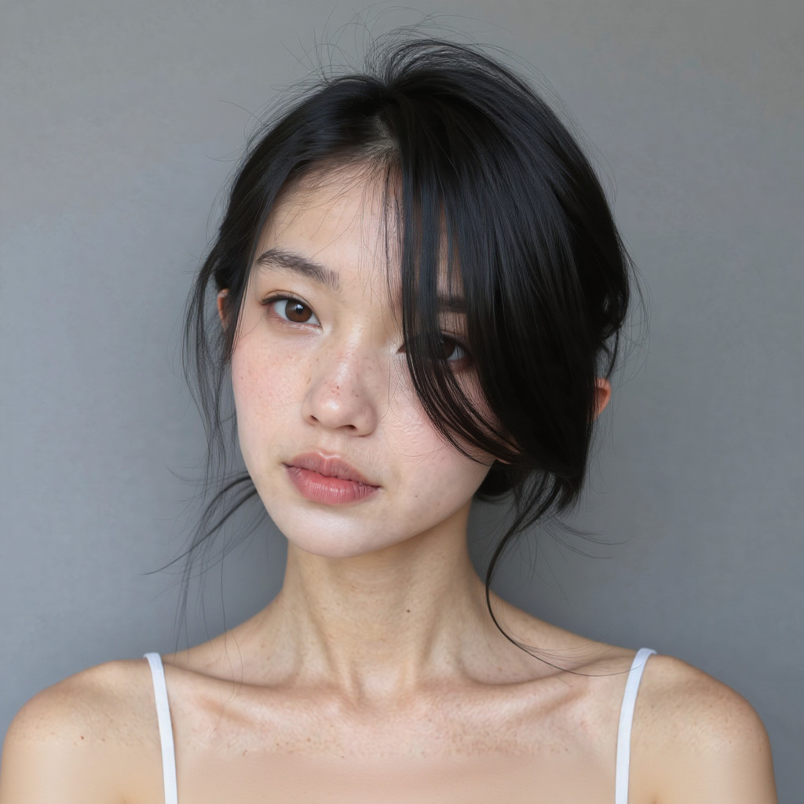

---

# Flux Kontext Face Variation Workflow

This repository provides a **ComfyUI workflow** that takes a portrait photo of a person’s face and generates **variations of the face from different angles** using the **Flux Kontext** model.

The workflow is designed to keep the hairstyle, position, scale, and framing consistent, while varying the perspective.

---

## ✨ Features

* Input: Single face image
* Output: Face variation with consistent styling
* Preserves:

  * Hairstyle
  * Scale and subject placement
  * Camera angle & perspective
* Generates:

  * Alternative views (e.g., side, rear, angled perspectives)

---

## 📦 Requirements

* [ComfyUI](https://github.com/comfyanonymous/ComfyUI) installed
* Flux Kontext model files:

  * `flux1-dev-kontext_fp8_scaled.safetensors` (UNet)
  * `flux1-dev.vae.safetensors` (VAE)
  * `clip_l.safetensors` and `t5xxl_fp16.safetensors` (text encoders)
* GPU with at least **16GB VRAM** (RTX 4090 or similar recommended)

---

## 🚀 Installation

1. Clone this repository:

   ```bash
   https://github.com/laonbud-grandsys/image_gen_tools.git
   cd image_gen_tools
   ```

2. Install [ComfyUI](https://github.com/comfyanonymous/ComfyUI) if not already installed.

3. Place the required model files into the appropriate ComfyUI directories:

   * UNet → `ComfyUI/models/unet/`
   * VAE → `ComfyUI/models/vae/`
   * CLIP/T5 → `ComfyUI/models/clip/`

4. Copy the provided workflow JSON into your `ComfyUI/custom_nodes` or load it via **ComfyUI → Load Workflow**.

---

## 🖼️ Usage

1. Launch ComfyUI:

   ```bash
   python main.py
   ```

2. Load the workflow file:

   * Go to **Workflow → Load → Select `face_var_generator.json`**.

3. Upload your input portrait image into the **Load Image** node.

4. Run the workflow.

   * The system will generate variations of the input face.
   * Output images will be saved with the prefix `ComfyUI_*` in your output directory.

---

## ⚙️ Workflow Details

Key components in the JSON:

* **Load Image** → input portrait
* **FluxKontextImageScale** → normalizes image size
* **VAE Encode / Decode** → latent space conversion
* **ReferenceLatent** + **FluxGuidance** → keeps input consistency
* **KSampler** → generates face variations
* **Save Image** → stores results

---

## 📂 Example

Input and Output variations
 

---

## ⚠️ Notes

* Best results with **frontal, high-quality face photos**.
* Strong occlusions (hands, glasses, hats) may reduce accuracy.
* Hairstyle is preserved, but accessories may vary.

---

## 📜 License

This project is released under the MIT License.
Please check the license of the Flux Kontext model before redistribution.

---

